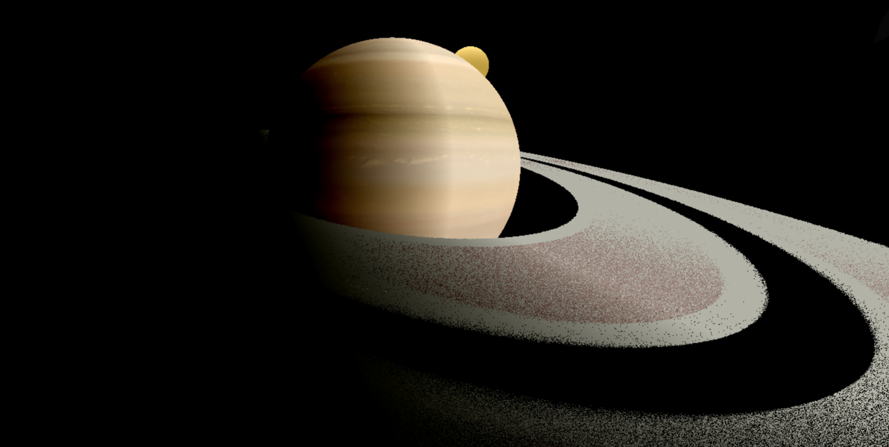
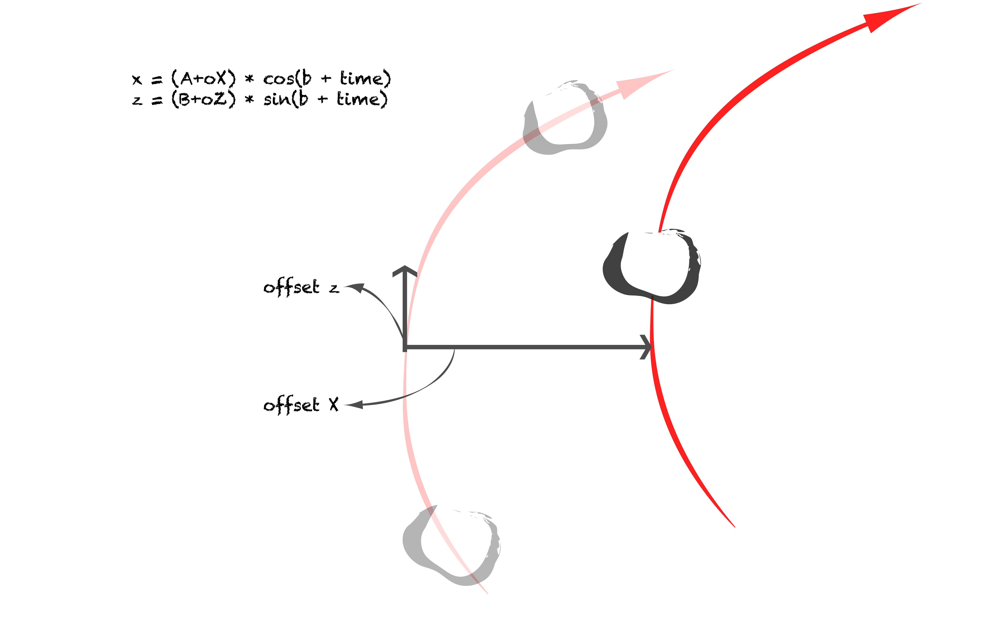
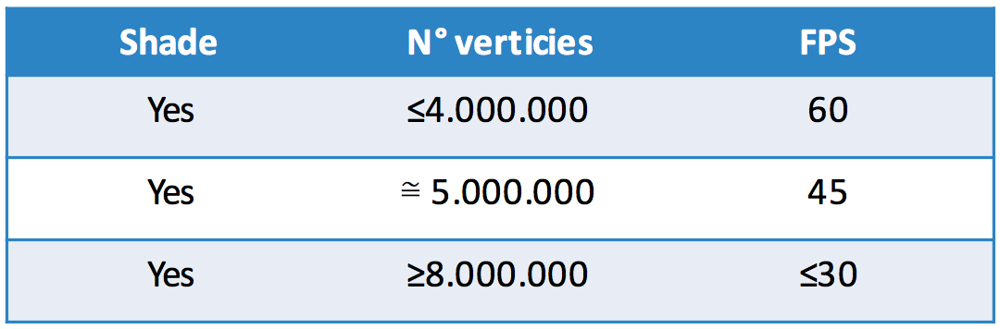

# PARTICLE REPRODUCTION OF SATURN'S SYSTEM - THREE.js & WebGL

### Aims
* Create a particle-system representation of Saturn Rings. 
* Use THREE.js as inteface to WebGL.
* Emphasize use of shaders and technologies studied. 
* Summary study on efficiency of application.

##### A well and examples fully documentation si available here: [Three.js](https://threejs.org)

### Saturn
* Like Jupiter, is a Giant Planet: it’s the second biggest planet of our solar system. 
* It’s largely composed by hydrogen and helium: it’s a gased planet.
* It has 88 moons and 16 rings. These rings are composed by debris and dust.
* It has a revolution period of 29 years and a day of 10 hours.

On this context we apply some semplifications on this enormous system: 
* Saturn is represented with 2 rings and 1 moon, Titan.
* Collisions betweendebrisaretrascured.
* Shapes of Saturn and Titano are rounded as spheres.

### Ring – Debris’s orbit
* Omitting Y dimension, the orbit of a single paritcle can easly be described by a formula like:
	* x = A*cos(t)
	* z = B*cos(t)
* Unfortunately, using formula like that for every verticies means positioning all in the same point.
* The result would be a single particle moving on elliptic orbit.
* A solution may be introduce a constant different for evry verticies. Orbit formula can be rewrite as:	
	* x = A*cos(base + t)
	* z = B*cos(base + t)

* Now all particles are disposed in different points of orbit: they compose a ring.
* It’s not enought: every particle need a certain freedom degree.
* To reach that purpose offsets on X and Z axis are now introduced.
* These offsets move out the particle from the “main” orbit.
* With right bounds on offsets, the resulting effect is something like a streched ring.
* Ending, orbit formula will be like:
	* x = (A + offsetX)*cos(base + t)
	* z = (B + offsetZ)*cos(base + t)

### Performances
It’s not easy to evaluate performances of a system strongly based on hardware design and software optimization. It’s only possible make some considerations:
* Using a MacBook Pro Retina (2,4 GHz Intel Core i5, Intel Iris 1536 MB) and Safari as reference, were observed results below:
